# Database Design Document

## 1. Purpose and Scope

This document defines the database design for the Pickleball Court Booking system, based on:
- `docs/project requirement.md`
- `docs/proposal.md`
- `docs/system-design-document.md`
- `docs/user-stories-functional.md`

Scope includes:
- Account and role management (`Customer`, `Admin`)
- Court inventory for private/shared booking
- Hold-to-pay workflow
- Payment (VNPay + Bank QR), webhook events, refunds
- Check-in code generation and redemption
- Cancellation policy and loyalty
- Audit, idempotency, and outbox for async processing

## 2. Database Platform and Conventions

- Engine: Aurora MySQL-Compatible (InnoDB)
- Charset/collation: `utf8mb4` / `utf8mb4_unicode_ci`
- Time storage: UTC in `datetime(6)`
- Primary keys: `char(36)` UUID format
- Naming:
  - Tables: snake_case plural
  - Foreign keys: `<ref_table_singular>_id`
  - Indexes: `ix_<table>_<cols>`

## 3. Core Business Rules Mapped to DB

1. No double booking for same court and same time
- Enforced by transactional locking on `court_buckets` rows and booking workflow constraints.

2. Shared booking max 8 slots per time frame
- `court_buckets.shared_capacity = 8`
- `court_buckets.shared_reserved <= shared_capacity`

3. Check-in code only after successful payment
- `checkin_codes` rows are created only after payment transition to `PAID`.

4. Payment idempotency
- Unique provider reference in `payments`.
- Event dedupe in `payment_events`.
- API idempotency in `idempotency_keys`.

5. Cancellation policy
- Policy table supports threshold and refund strategy.

## 4. Database Diagram (Mermaid ERD)

```mermaid
erDiagram
  USERS {
    string user_id PK
    string email UK
    string username UK
    string password_hash
    string phone_number
    string status
    datetime last_login_at
    datetime created_at
    datetime updated_at
  }

  ROLES {
    string role_id PK
    string role_name UK
    datetime created_at
  }

  USER_ROLES {
    string user_id PK
    string role_id PK
    datetime assigned_at
  }

  USER_PROFILES {
    string user_id PK
    string full_name
    string avatar_url
    date date_of_birth
    string emergency_contact
    datetime created_at
    datetime updated_at
  }

  PASSWORD_RESET_TOKENS {
    string token_id PK
    string user_id FK
    string token_hash UK
    datetime expires_at
    datetime used_at
    datetime created_at
  }

  COURTS {
    string court_id PK
    string court_code UK
    string court_name
    int sort_order
    boolean is_active
    string maintenance_reason
    datetime created_at
    datetime updated_at
  }

  TIME_BUCKETS {
    string bucket_id PK
    datetime start_at
    datetime end_at
    int duration_min
    datetime created_at
  }

  COURT_BUCKETS {
    string court_id PK
    string bucket_id PK
    string mode
    int shared_capacity
    int shared_reserved
    string private_hold_id
    int lock_version
    datetime updated_at
  }

  PRICING_RULES {
    string pricing_rule_id PK
    string rule_name
    string applies_to
    string day_type
    time start_time
    time end_time
    decimal private_rate
    decimal shared_rate
    decimal weekend_markup_pct
    boolean is_active
    datetime effective_from
    datetime effective_to
    string created_by_user_id FK
    datetime created_at
    datetime updated_at
  }

  CANCELLATION_POLICIES {
    string policy_id PK
    string policy_name
    int min_hours_before_start
    string refund_strategy
    decimal refund_percent
    decimal cancel_fee_percent
    boolean is_active
    datetime created_at
    datetime updated_at
  }

  HOLDS {
    string hold_id PK
    string user_id FK
    string status
    datetime expires_at
    datetime created_at
    datetime updated_at
  }

  HOLD_ITEMS {
    string hold_item_id PK
    string hold_id FK
    string court_id FK
    string bucket_id FK
    string booking_mode
    int slot_qty
    decimal unit_price
    decimal line_total
    datetime created_at
  }

  BOOKINGS {
    string booking_id PK
    string user_id FK
    string hold_id UK
    string status
    decimal total_amount
    date booking_date
    datetime start_at
    datetime end_at
    string cancellation_policy_id FK
    datetime cancelled_at
    datetime confirmed_at
    datetime completed_at
    datetime created_at
    datetime updated_at
  }

  BOOKING_ITEMS {
    string booking_item_id PK
    string booking_id FK
    string court_id FK
    string bucket_id FK
    string booking_mode
    int slot_qty
    decimal unit_price
    decimal line_total
    string status
    datetime created_at
    datetime updated_at
  }

  CHECKOUT_ORDERS {
    string order_id PK
    string user_id FK
    string status
    decimal subtotal_amount
    decimal discount_amount
    decimal total_amount
    string currency
    datetime expires_at
    datetime created_at
    datetime updated_at
  }

  CHECKOUT_ORDER_ITEMS {
    string order_item_id PK
    string order_id FK
    string booking_id FK
    datetime created_at
  }

  PAYMENTS {
    string payment_id PK
    string order_id FK
    string provider
    string status
    decimal amount
    string currency
    string provider_ref UK
    string provider_txn_no
    datetime paid_at
    string failed_reason
    datetime created_at
    datetime updated_at
  }

  PAYMENT_EVENTS {
    string payment_event_id PK
    string payment_id FK
    string provider_event_id UK
    string event_type
    boolean signature_valid
    string request_hash
    string raw_payload
    datetime received_at
    datetime created_at
  }

  REFUNDS {
    string refund_id PK
    string payment_id FK
    string refund_type
    string status
    decimal amount
    string reason
    string provider_refund_ref
    string approved_by_admin_id FK
    datetime created_at
    datetime updated_at
  }

  CANCELLATION_REQUESTS {
    string cancellation_request_id PK
    string booking_id FK
    string requested_by_user_id FK
    string status
    string reason
    decimal refund_amount
    string processed_by_admin_id FK
    datetime processed_at
    datetime created_at
    datetime updated_at
  }

  CHECKIN_CODES {
    string checkin_code_id PK
    string booking_item_id FK
    int slot_no
    string code UK
    string status
    datetime expires_at
    datetime used_at
    string used_by_admin_id FK
    datetime created_at
    datetime updated_at
  }

  LOYALTY_ACCOUNTS {
    string user_id PK
    int current_points
    string tier
    datetime updated_at
  }

  LOYALTY_LEDGER {
    string loyalty_ledger_id PK
    string user_id FK
    string booking_id FK
    int points_delta
    string reason
    datetime created_at
  }

  IDEMPOTENCY_KEYS {
    string idempotency_id PK
    string scope
    string endpoint
    string idempotency_key
    string request_hash
    int response_status
    string response_snapshot
    datetime expires_at
    datetime created_at
  }

  AUDIT_LOGS {
    string audit_log_id PK
    string actor_user_id FK
    string actor_role
    string action
    string entity_name
    string entity_id
    string before_json
    string after_json
    string ip_address
    datetime created_at
  }

  OUTBOX_EVENTS {
    string outbox_event_id PK
    string event_type
    string aggregate_type
    string aggregate_id
    string payload_json
    string status
    int retry_count
    datetime available_at
    datetime created_at
    datetime updated_at
  }

  USERS ||--o{ USER_ROLES : has
  ROLES ||--o{ USER_ROLES : assigned_to
  USERS ||--|| USER_PROFILES : owns
  USERS ||--o{ PASSWORD_RESET_TOKENS : resets

  USERS ||--o{ HOLDS : creates
  HOLDS ||--o{ HOLD_ITEMS : contains
  COURTS ||--o{ HOLD_ITEMS : reserved_on
  TIME_BUCKETS ||--o{ HOLD_ITEMS : reserved_at

  COURTS ||--o{ COURT_BUCKETS : has
  TIME_BUCKETS ||--o{ COURT_BUCKETS : has

  HOLDS o|--|| BOOKINGS : converts_to
  USERS ||--o{ BOOKINGS : owns
  CANCELLATION_POLICIES ||--o{ BOOKINGS : applies_to
  BOOKINGS ||--o{ BOOKING_ITEMS : contains
  COURTS ||--o{ BOOKING_ITEMS : allocated_on
  TIME_BUCKETS ||--o{ BOOKING_ITEMS : allocated_at

  USERS ||--o{ CHECKOUT_ORDERS : creates
  CHECKOUT_ORDERS ||--o{ CHECKOUT_ORDER_ITEMS : groups
  BOOKINGS ||--o{ CHECKOUT_ORDER_ITEMS : linked

  CHECKOUT_ORDERS ||--o{ PAYMENTS : paid_by
  PAYMENTS ||--o{ PAYMENT_EVENTS : emits
  PAYMENTS ||--o{ REFUNDS : refunded_by

  BOOKINGS ||--o{ CANCELLATION_REQUESTS : requests
  BOOKING_ITEMS ||--o{ CHECKIN_CODES : issues

  USERS ||--o{ PRICING_RULES : creates
  USERS ||--o{ REFUNDS : approves
  USERS ||--o{ CANCELLATION_REQUESTS : submits
  USERS ||--o{ CANCELLATION_REQUESTS : processes
  USERS ||--o{ CHECKIN_CODES : redeems

  USERS ||--|| LOYALTY_ACCOUNTS : has
  LOYALTY_ACCOUNTS ||--o{ LOYALTY_LEDGER : records
  BOOKINGS ||--o{ LOYALTY_LEDGER : source

  USERS ||--o{ AUDIT_LOGS : acts
```


## 5. Complete SQL Schema

```sql
-- =========================================================
-- Pickleball Court Booking - Complete SQL Schema
-- Target: Aurora MySQL-Compatible (InnoDB)
-- =========================================================

CREATE DATABASE IF NOT EXISTS rental_app
  CHARACTER SET utf8mb4
  COLLATE utf8mb4_unicode_ci;

USE rental_app;

SET NAMES utf8mb4;
SET time_zone = '+00:00';

-- =========================================================
-- 5.1 Identity and Access
-- =========================================================

CREATE TABLE IF NOT EXISTS users (
  user_id              CHAR(36)      NOT NULL,
  email                VARCHAR(255)  NOT NULL,
  username             VARCHAR(100)  NOT NULL,
  password_hash        VARCHAR(512)  NOT NULL,
  phone_number         VARCHAR(20)   NULL,
  status               ENUM('ACTIVE','LOCKED','DISABLED') NOT NULL DEFAULT 'ACTIVE',
  last_login_at        DATETIME(6)   NULL,
  created_at           DATETIME(6)   NOT NULL DEFAULT CURRENT_TIMESTAMP(6),
  updated_at           DATETIME(6)   NOT NULL DEFAULT CURRENT_TIMESTAMP(6) ON UPDATE CURRENT_TIMESTAMP(6),
  PRIMARY KEY (user_id),
  UNIQUE KEY uq_users_email (email),
  UNIQUE KEY uq_users_username (username)
) ENGINE=InnoDB;

CREATE TABLE IF NOT EXISTS roles (
  role_id              CHAR(36)      NOT NULL,
  role_name            VARCHAR(50)   NOT NULL,
  created_at           DATETIME(6)   NOT NULL DEFAULT CURRENT_TIMESTAMP(6),
  PRIMARY KEY (role_id),
  UNIQUE KEY uq_roles_name (role_name)
) ENGINE=InnoDB;

CREATE TABLE IF NOT EXISTS user_roles (
  user_id              CHAR(36)      NOT NULL,
  role_id              CHAR(36)      NOT NULL,
  assigned_at          DATETIME(6)   NOT NULL DEFAULT CURRENT_TIMESTAMP(6),
  PRIMARY KEY (user_id, role_id),
  CONSTRAINT fk_user_roles_user
    FOREIGN KEY (user_id) REFERENCES users(user_id),
  CONSTRAINT fk_user_roles_role
    FOREIGN KEY (role_id) REFERENCES roles(role_id)
) ENGINE=InnoDB;

CREATE TABLE IF NOT EXISTS user_profiles (
  user_id              CHAR(36)      NOT NULL,
  full_name            VARCHAR(150)  NULL,
  avatar_url           VARCHAR(500)  NULL,
  date_of_birth        DATE          NULL,
  emergency_contact    VARCHAR(50)   NULL,
  created_at           DATETIME(6)   NOT NULL DEFAULT CURRENT_TIMESTAMP(6),
  updated_at           DATETIME(6)   NOT NULL DEFAULT CURRENT_TIMESTAMP(6) ON UPDATE CURRENT_TIMESTAMP(6),
  PRIMARY KEY (user_id),
  CONSTRAINT fk_user_profiles_user
    FOREIGN KEY (user_id) REFERENCES users(user_id)
) ENGINE=InnoDB;

CREATE TABLE IF NOT EXISTS password_reset_tokens (
  token_id             CHAR(36)      NOT NULL,
  user_id              CHAR(36)      NOT NULL,
  token_hash           CHAR(64)      NOT NULL,
  expires_at           DATETIME(6)   NOT NULL,
  used_at              DATETIME(6)   NULL,
  created_at           DATETIME(6)   NOT NULL DEFAULT CURRENT_TIMESTAMP(6),
  PRIMARY KEY (token_id),
  UNIQUE KEY uq_password_reset_token_hash (token_hash),
  KEY ix_password_reset_user (user_id),
  KEY ix_password_reset_expires (expires_at),
  CONSTRAINT fk_password_reset_user
    FOREIGN KEY (user_id) REFERENCES users(user_id)
) ENGINE=InnoDB;

-- =========================================================
-- 5.2 Courts, Time Buckets, Inventory
-- =========================================================

CREATE TABLE IF NOT EXISTS courts (
  court_id             CHAR(36)      NOT NULL,
  court_code           VARCHAR(20)   NOT NULL,
  court_name           VARCHAR(100)  NOT NULL,
  sort_order           TINYINT UNSIGNED NOT NULL,
  is_active            TINYINT(1)    NOT NULL DEFAULT 1,
  maintenance_reason   VARCHAR(255)  NULL,
  created_at           DATETIME(6)   NOT NULL DEFAULT CURRENT_TIMESTAMP(6),
  updated_at           DATETIME(6)   NOT NULL DEFAULT CURRENT_TIMESTAMP(6) ON UPDATE CURRENT_TIMESTAMP(6),
  PRIMARY KEY (court_id),
  UNIQUE KEY uq_courts_code (court_code),
  KEY ix_courts_active (is_active)
) ENGINE=InnoDB;

CREATE TABLE IF NOT EXISTS time_buckets (
  bucket_id            CHAR(36)      NOT NULL,
  start_at             DATETIME(6)   NOT NULL,
  end_at               DATETIME(6)   NOT NULL,
  duration_min         SMALLINT      NOT NULL,
  created_at           DATETIME(6)   NOT NULL DEFAULT CURRENT_TIMESTAMP(6),
  PRIMARY KEY (bucket_id),
  UNIQUE KEY uq_time_buckets_window (start_at, end_at),
  KEY ix_time_buckets_start (start_at),
  CONSTRAINT chk_time_bucket_range CHECK (end_at > start_at)
) ENGINE=InnoDB;

CREATE TABLE IF NOT EXISTS court_buckets (
  court_id             CHAR(36)      NOT NULL,
  bucket_id            CHAR(36)      NOT NULL,
  mode                 ENUM('NONE','PRIVATE','SHARED') NOT NULL DEFAULT 'NONE',
  shared_capacity      TINYINT UNSIGNED NOT NULL DEFAULT 8,
  shared_reserved      TINYINT UNSIGNED NOT NULL DEFAULT 0,
  private_hold_id      CHAR(36)      NULL,
  lock_version         INT UNSIGNED  NOT NULL DEFAULT 0,
  updated_at           DATETIME(6)   NOT NULL DEFAULT CURRENT_TIMESTAMP(6) ON UPDATE CURRENT_TIMESTAMP(6),
  PRIMARY KEY (court_id, bucket_id),
  KEY ix_court_buckets_mode (mode),
  CONSTRAINT fk_court_buckets_court
    FOREIGN KEY (court_id) REFERENCES courts(court_id),
  CONSTRAINT fk_court_buckets_bucket
    FOREIGN KEY (bucket_id) REFERENCES time_buckets(bucket_id),
  CONSTRAINT chk_shared_reserved CHECK (shared_reserved <= shared_capacity)
) ENGINE=InnoDB;

-- =========================================================
-- 5.3 Pricing and Policies
-- =========================================================

CREATE TABLE IF NOT EXISTS pricing_rules (
  pricing_rule_id      CHAR(36)      NOT NULL,
  rule_name            VARCHAR(120)  NOT NULL,
  applies_to           ENUM('ANY','PRIVATE','SHARED') NOT NULL DEFAULT 'ANY',
  day_type             ENUM('ANY','WEEKDAY','WEEKEND') NOT NULL DEFAULT 'ANY',
  start_time           TIME          NULL,
  end_time             TIME          NULL,
  private_rate         DECIMAL(12,2) NOT NULL,
  shared_rate          DECIMAL(12,2) NOT NULL,
  weekend_markup_pct   DECIMAL(5,2)  NOT NULL DEFAULT 0.00,
  is_active            TINYINT(1)    NOT NULL DEFAULT 1,
  effective_from       DATETIME(6)   NOT NULL,
  effective_to         DATETIME(6)   NULL,
  created_by_user_id   CHAR(36)      NOT NULL,
  created_at           DATETIME(6)   NOT NULL DEFAULT CURRENT_TIMESTAMP(6),
  updated_at           DATETIME(6)   NOT NULL DEFAULT CURRENT_TIMESTAMP(6) ON UPDATE CURRENT_TIMESTAMP(6),
  PRIMARY KEY (pricing_rule_id),
  KEY ix_pricing_rules_active_effective (is_active, effective_from),
  CONSTRAINT fk_pricing_rules_created_by
    FOREIGN KEY (created_by_user_id) REFERENCES users(user_id),
  CONSTRAINT chk_pricing_effective_range CHECK (effective_to IS NULL OR effective_to > effective_from)
) ENGINE=InnoDB;

CREATE TABLE IF NOT EXISTS cancellation_policies (
  policy_id            CHAR(36)      NOT NULL,
  policy_name          VARCHAR(100)  NOT NULL,
  min_hours_before_start INT         NOT NULL DEFAULT 2,
  refund_strategy      ENUM('FULL','PARTIAL','NONE','WALLET') NOT NULL,
  refund_percent       DECIMAL(5,2)  NULL,
  cancel_fee_percent   DECIMAL(5,2)  NOT NULL DEFAULT 0.00,
  is_active            TINYINT(1)    NOT NULL DEFAULT 1,
  created_at           DATETIME(6)   NOT NULL DEFAULT CURRENT_TIMESTAMP(6),
  updated_at           DATETIME(6)   NOT NULL DEFAULT CURRENT_TIMESTAMP(6) ON UPDATE CURRENT_TIMESTAMP(6),
  PRIMARY KEY (policy_id),
  KEY ix_cancellation_policy_active (is_active),
  CONSTRAINT chk_refund_percent CHECK (refund_percent IS NULL OR (refund_percent >= 0 AND refund_percent <= 100)),
  CONSTRAINT chk_cancel_fee_percent CHECK (cancel_fee_percent >= 0 AND cancel_fee_percent <= 100)
) ENGINE=InnoDB;

-- =========================================================
-- 5.4 Hold, Booking, Checkout
-- =========================================================

CREATE TABLE IF NOT EXISTS holds (
  hold_id              CHAR(36)      NOT NULL,
  user_id              CHAR(36)      NOT NULL,
  status               ENUM('ACTIVE','EXPIRED','CONVERTED','CANCELLED') NOT NULL,
  expires_at           DATETIME(6)   NOT NULL,
  created_at           DATETIME(6)   NOT NULL DEFAULT CURRENT_TIMESTAMP(6),
  updated_at           DATETIME(6)   NOT NULL DEFAULT CURRENT_TIMESTAMP(6) ON UPDATE CURRENT_TIMESTAMP(6),
  PRIMARY KEY (hold_id),
  KEY ix_holds_status_expires (status, expires_at),
  KEY ix_holds_user_created (user_id, created_at),
  CONSTRAINT fk_holds_user
    FOREIGN KEY (user_id) REFERENCES users(user_id)
) ENGINE=InnoDB;

CREATE TABLE IF NOT EXISTS hold_items (
  hold_item_id         CHAR(36)      NOT NULL,
  hold_id              CHAR(36)      NOT NULL,
  court_id             CHAR(36)      NOT NULL,
  bucket_id            CHAR(36)      NOT NULL,
  booking_mode         ENUM('PRIVATE','SHARED') NOT NULL,
  slot_qty             TINYINT UNSIGNED NOT NULL DEFAULT 1,
  unit_price           DECIMAL(12,2) NOT NULL,
  line_total           DECIMAL(12,2) NOT NULL,
  created_at           DATETIME(6)   NOT NULL DEFAULT CURRENT_TIMESTAMP(6),
  PRIMARY KEY (hold_item_id),
  UNIQUE KEY uq_hold_items_scope (hold_id, court_id, bucket_id, booking_mode),
  KEY ix_hold_items_court_bucket (court_id, bucket_id),
  CONSTRAINT fk_hold_items_hold
    FOREIGN KEY (hold_id) REFERENCES holds(hold_id),
  CONSTRAINT fk_hold_items_court
    FOREIGN KEY (court_id) REFERENCES courts(court_id),
  CONSTRAINT fk_hold_items_bucket
    FOREIGN KEY (bucket_id) REFERENCES time_buckets(bucket_id),
  CONSTRAINT chk_hold_items_qty CHECK (slot_qty > 0)
) ENGINE=InnoDB;

CREATE TABLE IF NOT EXISTS bookings (
  booking_id           CHAR(36)      NOT NULL,
  user_id              CHAR(36)      NOT NULL,
  hold_id              CHAR(36)      NULL,
  status               ENUM('PENDING','CONFIRMED','CANCELLED','COMPLETED') NOT NULL,
  total_amount         DECIMAL(12,2) NOT NULL,
  booking_date         DATE          NOT NULL,
  start_at             DATETIME(6)   NOT NULL,
  end_at               DATETIME(6)   NOT NULL,
  cancellation_policy_id CHAR(36)    NULL,
  cancelled_at         DATETIME(6)   NULL,
  confirmed_at         DATETIME(6)   NULL,
  completed_at         DATETIME(6)   NULL,
  created_at           DATETIME(6)   NOT NULL DEFAULT CURRENT_TIMESTAMP(6),
  updated_at           DATETIME(6)   NOT NULL DEFAULT CURRENT_TIMESTAMP(6) ON UPDATE CURRENT_TIMESTAMP(6),
  PRIMARY KEY (booking_id),
  UNIQUE KEY uq_bookings_hold (hold_id),
  KEY ix_bookings_user_created (user_id, created_at),
  KEY ix_bookings_status_date (status, booking_date),
  CONSTRAINT fk_bookings_user
    FOREIGN KEY (user_id) REFERENCES users(user_id),
  CONSTRAINT fk_bookings_hold
    FOREIGN KEY (hold_id) REFERENCES holds(hold_id),
  CONSTRAINT fk_bookings_cancellation_policy
    FOREIGN KEY (cancellation_policy_id) REFERENCES cancellation_policies(policy_id),
  CONSTRAINT chk_bookings_time_range CHECK (end_at > start_at)
) ENGINE=InnoDB;

CREATE TABLE IF NOT EXISTS booking_items (
  booking_item_id      CHAR(36)      NOT NULL,
  booking_id           CHAR(36)      NOT NULL,
  court_id             CHAR(36)      NOT NULL,
  bucket_id            CHAR(36)      NOT NULL,
  booking_mode         ENUM('PRIVATE','SHARED') NOT NULL,
  slot_qty             TINYINT UNSIGNED NOT NULL DEFAULT 1,
  unit_price           DECIMAL(12,2) NOT NULL,
  line_total           DECIMAL(12,2) NOT NULL,
  status               ENUM('ACTIVE','CANCELLED','COMPLETED') NOT NULL DEFAULT 'ACTIVE',
  created_at           DATETIME(6)   NOT NULL DEFAULT CURRENT_TIMESTAMP(6),
  updated_at           DATETIME(6)   NOT NULL DEFAULT CURRENT_TIMESTAMP(6) ON UPDATE CURRENT_TIMESTAMP(6),
  PRIMARY KEY (booking_item_id),
  KEY ix_booking_items_booking (booking_id),
  KEY ix_booking_items_court_bucket (court_id, bucket_id),
  CONSTRAINT fk_booking_items_booking
    FOREIGN KEY (booking_id) REFERENCES bookings(booking_id),
  CONSTRAINT fk_booking_items_court
    FOREIGN KEY (court_id) REFERENCES courts(court_id),
  CONSTRAINT fk_booking_items_bucket
    FOREIGN KEY (bucket_id) REFERENCES time_buckets(bucket_id),
  CONSTRAINT chk_booking_items_qty CHECK (slot_qty > 0)
) ENGINE=InnoDB;

CREATE TABLE IF NOT EXISTS checkout_orders (
  order_id             CHAR(36)      NOT NULL,
  user_id              CHAR(36)      NOT NULL,
  status               ENUM('PENDING','PAID','FAILED','CANCELLED','EXPIRED') NOT NULL,
  subtotal_amount      DECIMAL(12,2) NOT NULL,
  discount_amount      DECIMAL(12,2) NOT NULL DEFAULT 0.00,
  total_amount         DECIMAL(12,2) NOT NULL,
  currency             CHAR(3)       NOT NULL DEFAULT 'VND',
  expires_at           DATETIME(6)   NULL,
  created_at           DATETIME(6)   NOT NULL DEFAULT CURRENT_TIMESTAMP(6),
  updated_at           DATETIME(6)   NOT NULL DEFAULT CURRENT_TIMESTAMP(6) ON UPDATE CURRENT_TIMESTAMP(6),
  PRIMARY KEY (order_id),
  KEY ix_checkout_orders_user_created (user_id, created_at),
  KEY ix_checkout_orders_status_created (status, created_at),
  CONSTRAINT fk_checkout_orders_user
    FOREIGN KEY (user_id) REFERENCES users(user_id)
) ENGINE=InnoDB;

CREATE TABLE IF NOT EXISTS checkout_order_items (
  order_item_id        CHAR(36)      NOT NULL,
  order_id             CHAR(36)      NOT NULL,
  booking_id           CHAR(36)      NOT NULL,
  created_at           DATETIME(6)   NOT NULL DEFAULT CURRENT_TIMESTAMP(6),
  PRIMARY KEY (order_item_id),
  UNIQUE KEY uq_checkout_order_booking (order_id, booking_id),
  KEY ix_checkout_order_items_booking (booking_id),
  CONSTRAINT fk_checkout_order_items_order
    FOREIGN KEY (order_id) REFERENCES checkout_orders(order_id),
  CONSTRAINT fk_checkout_order_items_booking
    FOREIGN KEY (booking_id) REFERENCES bookings(booking_id)
) ENGINE=InnoDB;

-- =========================================================
-- 5.5 Payment, Events, Refunds, Cancellations
-- =========================================================

CREATE TABLE IF NOT EXISTS payments (
  payment_id           CHAR(36)      NOT NULL,
  order_id             CHAR(36)      NOT NULL,
  provider             ENUM('VNPAY','BANKQR') NOT NULL,
  status               ENUM('PENDING','PAID','FAILED','EXPIRED','REFUNDED','PARTIALLY_REFUNDED') NOT NULL,
  amount               DECIMAL(12,2) NOT NULL,
  currency             CHAR(3)       NOT NULL DEFAULT 'VND',
  provider_ref         VARCHAR(100)  NOT NULL,
  provider_txn_no      VARCHAR(100)  NULL,
  paid_at              DATETIME(6)   NULL,
  failed_reason        VARCHAR(255)  NULL,
  created_at           DATETIME(6)   NOT NULL DEFAULT CURRENT_TIMESTAMP(6),
  updated_at           DATETIME(6)   NOT NULL DEFAULT CURRENT_TIMESTAMP(6) ON UPDATE CURRENT_TIMESTAMP(6),
  PRIMARY KEY (payment_id),
  UNIQUE KEY uq_payments_provider_ref (provider, provider_ref),
  KEY ix_payments_order (order_id),
  KEY ix_payments_status_created (status, created_at),
  CONSTRAINT fk_payments_order
    FOREIGN KEY (order_id) REFERENCES checkout_orders(order_id)
) ENGINE=InnoDB;

CREATE TABLE IF NOT EXISTS payment_events (
  payment_event_id     CHAR(36)      NOT NULL,
  payment_id           CHAR(36)      NOT NULL,
  provider_event_id    VARCHAR(120)  NULL,
  event_type           VARCHAR(50)   NOT NULL,
  signature_valid      TINYINT(1)    NOT NULL DEFAULT 0,
  request_hash         CHAR(64)      NOT NULL,
  raw_payload          LONGTEXT      NOT NULL,
  received_at          DATETIME(6)   NOT NULL,
  created_at           DATETIME(6)   NOT NULL DEFAULT CURRENT_TIMESTAMP(6),
  PRIMARY KEY (payment_event_id),
  UNIQUE KEY uq_payment_events_provider_event (provider_event_id),
  UNIQUE KEY uq_payment_events_hash (payment_id, request_hash),
  KEY ix_payment_events_payment_received (payment_id, received_at),
  CONSTRAINT fk_payment_events_payment
    FOREIGN KEY (payment_id) REFERENCES payments(payment_id)
) ENGINE=InnoDB;

CREATE TABLE IF NOT EXISTS refunds (
  refund_id            CHAR(36)      NOT NULL,
  payment_id           CHAR(36)      NOT NULL,
  refund_type          ENUM('FULL','PARTIAL','WALLET') NOT NULL,
  status               ENUM('PENDING','APPROVED','PROCESSING','COMPLETED','FAILED','REJECTED') NOT NULL,
  amount               DECIMAL(12,2) NOT NULL,
  reason               VARCHAR(255)  NULL,
  provider_refund_ref  VARCHAR(120)  NULL,
  approved_by_admin_id CHAR(36)      NULL,
  created_at           DATETIME(6)   NOT NULL DEFAULT CURRENT_TIMESTAMP(6),
  updated_at           DATETIME(6)   NOT NULL DEFAULT CURRENT_TIMESTAMP(6) ON UPDATE CURRENT_TIMESTAMP(6),
  PRIMARY KEY (refund_id),
  KEY ix_refunds_payment (payment_id),
  KEY ix_refunds_status_created (status, created_at),
  CONSTRAINT fk_refunds_payment
    FOREIGN KEY (payment_id) REFERENCES payments(payment_id),
  CONSTRAINT fk_refunds_admin
    FOREIGN KEY (approved_by_admin_id) REFERENCES users(user_id)
) ENGINE=InnoDB;

CREATE TABLE IF NOT EXISTS cancellation_requests (
  cancellation_request_id CHAR(36)   NOT NULL,
  booking_id           CHAR(36)      NOT NULL,
  requested_by_user_id CHAR(36)      NOT NULL,
  status               ENUM('REQUESTED','APPROVED','REJECTED','REFUNDED') NOT NULL DEFAULT 'REQUESTED',
  reason               VARCHAR(255)  NULL,
  refund_amount        DECIMAL(12,2) NULL,
  processed_by_admin_id CHAR(36)     NULL,
  processed_at         DATETIME(6)   NULL,
  created_at           DATETIME(6)   NOT NULL DEFAULT CURRENT_TIMESTAMP(6),
  updated_at           DATETIME(6)   NOT NULL DEFAULT CURRENT_TIMESTAMP(6) ON UPDATE CURRENT_TIMESTAMP(6),
  PRIMARY KEY (cancellation_request_id),
  KEY ix_cancellation_requests_booking (booking_id),
  KEY ix_cancellation_requests_status_created (status, created_at),
  CONSTRAINT fk_cancellation_requests_booking
    FOREIGN KEY (booking_id) REFERENCES bookings(booking_id),
  CONSTRAINT fk_cancellation_requests_requested_by
    FOREIGN KEY (requested_by_user_id) REFERENCES users(user_id),
  CONSTRAINT fk_cancellation_requests_processed_by
    FOREIGN KEY (processed_by_admin_id) REFERENCES users(user_id)
) ENGINE=InnoDB;

-- =========================================================
-- 5.6 Check-in and Loyalty
-- =========================================================

CREATE TABLE IF NOT EXISTS checkin_codes (
  checkin_code_id       CHAR(36)     NOT NULL,
  booking_item_id       CHAR(36)     NOT NULL,
  slot_no               SMALLINT UNSIGNED NOT NULL DEFAULT 1,
  code                  VARCHAR(20)  NOT NULL,
  status                ENUM('ACTIVE','USED','EXPIRED') NOT NULL,
  expires_at            DATETIME(6)  NOT NULL,
  used_at               DATETIME(6)  NULL,
  used_by_admin_id      CHAR(36)     NULL,
  created_at            DATETIME(6)  NOT NULL DEFAULT CURRENT_TIMESTAMP(6),
  updated_at            DATETIME(6)  NOT NULL DEFAULT CURRENT_TIMESTAMP(6) ON UPDATE CURRENT_TIMESTAMP(6),
  PRIMARY KEY (checkin_code_id),
  UNIQUE KEY uq_checkin_codes_code (code),
  UNIQUE KEY uq_checkin_codes_booking_slot (booking_item_id, slot_no),
  KEY ix_checkin_codes_status_expires (status, expires_at),
  CONSTRAINT fk_checkin_codes_booking_item
    FOREIGN KEY (booking_item_id) REFERENCES booking_items(booking_item_id),
  CONSTRAINT fk_checkin_codes_admin
    FOREIGN KEY (used_by_admin_id) REFERENCES users(user_id)
) ENGINE=InnoDB;

CREATE TABLE IF NOT EXISTS loyalty_accounts (
  user_id               CHAR(36)     NOT NULL,
  current_points        INT          NOT NULL DEFAULT 0,
  tier                  ENUM('SILVER','GOLD','PLATINUM') NOT NULL DEFAULT 'SILVER',
  updated_at            DATETIME(6)  NOT NULL DEFAULT CURRENT_TIMESTAMP(6) ON UPDATE CURRENT_TIMESTAMP(6),
  PRIMARY KEY (user_id),
  CONSTRAINT fk_loyalty_accounts_user
    FOREIGN KEY (user_id) REFERENCES users(user_id)
) ENGINE=InnoDB;

CREATE TABLE IF NOT EXISTS loyalty_ledger (
  loyalty_ledger_id     CHAR(36)     NOT NULL,
  user_id               CHAR(36)     NOT NULL,
  booking_id            CHAR(36)     NULL,
  points_delta          INT          NOT NULL,
  reason                VARCHAR(120) NOT NULL,
  created_at            DATETIME(6)  NOT NULL DEFAULT CURRENT_TIMESTAMP(6),
  PRIMARY KEY (loyalty_ledger_id),
  KEY ix_loyalty_ledger_user_created (user_id, created_at),
  KEY ix_loyalty_ledger_booking (booking_id),
  CONSTRAINT fk_loyalty_ledger_user
    FOREIGN KEY (user_id) REFERENCES loyalty_accounts(user_id),
  CONSTRAINT fk_loyalty_ledger_booking
    FOREIGN KEY (booking_id) REFERENCES bookings(booking_id)
) ENGINE=InnoDB;

-- =========================================================
-- 5.7 Cross-cutting: Idempotency, Audit, Outbox
-- =========================================================

CREATE TABLE IF NOT EXISTS idempotency_keys (
  idempotency_id        CHAR(36)     NOT NULL,
  scope                 VARCHAR(120) NOT NULL,
  endpoint              VARCHAR(200) NOT NULL,
  idempotency_key       VARCHAR(120) NOT NULL,
  request_hash          CHAR(64)     NOT NULL,
  response_status       INT          NOT NULL,
  response_snapshot     LONGTEXT     NOT NULL,
  expires_at            DATETIME(6)  NOT NULL,
  created_at            DATETIME(6)  NOT NULL DEFAULT CURRENT_TIMESTAMP(6),
  PRIMARY KEY (idempotency_id),
  UNIQUE KEY uq_idempotency_scope_endpoint_key (scope, endpoint, idempotency_key),
  KEY ix_idempotency_expires (expires_at)
) ENGINE=InnoDB;

CREATE TABLE IF NOT EXISTS audit_logs (
  audit_log_id          CHAR(36)     NOT NULL,
  actor_user_id         CHAR(36)     NULL,
  actor_role            VARCHAR(30)  NULL,
  action                VARCHAR(80)  NOT NULL,
  entity_name           VARCHAR(80)  NOT NULL,
  entity_id             CHAR(36)     NULL,
  before_json           LONGTEXT     NULL,
  after_json            LONGTEXT     NULL,
  ip_address            VARCHAR(45)  NULL,
  created_at            DATETIME(6)  NOT NULL DEFAULT CURRENT_TIMESTAMP(6),
  PRIMARY KEY (audit_log_id),
  KEY ix_audit_logs_entity (entity_name, entity_id),
  KEY ix_audit_logs_created (created_at),
  CONSTRAINT fk_audit_logs_actor
    FOREIGN KEY (actor_user_id) REFERENCES users(user_id)
) ENGINE=InnoDB;

CREATE TABLE IF NOT EXISTS outbox_events (
  outbox_event_id       CHAR(36)     NOT NULL,
  event_type            VARCHAR(120) NOT NULL,
  aggregate_type        VARCHAR(80)  NOT NULL,
  aggregate_id          CHAR(36)     NOT NULL,
  payload_json          LONGTEXT     NOT NULL,
  status                ENUM('PENDING','PROCESSING','DONE','FAILED') NOT NULL DEFAULT 'PENDING',
  retry_count           INT          NOT NULL DEFAULT 0,
  available_at          DATETIME(6)  NOT NULL,
  created_at            DATETIME(6)  NOT NULL DEFAULT CURRENT_TIMESTAMP(6),
  updated_at            DATETIME(6)  NOT NULL DEFAULT CURRENT_TIMESTAMP(6) ON UPDATE CURRENT_TIMESTAMP(6),
  PRIMARY KEY (outbox_event_id),
  KEY ix_outbox_status_available (status, available_at)
) ENGINE=InnoDB;

-- =========================================================
-- 5.8 Seed Data (roles + 9 courts)
-- =========================================================

INSERT INTO roles (role_id, role_name)
SELECT UUID(), 'Admin'
WHERE NOT EXISTS (SELECT 1 FROM roles WHERE role_name = 'Admin');

INSERT INTO roles (role_id, role_name)
SELECT UUID(), 'Customer'
WHERE NOT EXISTS (SELECT 1 FROM roles WHERE role_name = 'Customer');

INSERT INTO courts (court_id, court_code, court_name, sort_order, is_active)
SELECT UUID(), 'C01', 'Court 01', 1, 1
WHERE NOT EXISTS (SELECT 1 FROM courts WHERE court_code = 'C01');

INSERT INTO courts (court_id, court_code, court_name, sort_order, is_active)
SELECT UUID(), 'C02', 'Court 02', 2, 1
WHERE NOT EXISTS (SELECT 1 FROM courts WHERE court_code = 'C02');

INSERT INTO courts (court_id, court_code, court_name, sort_order, is_active)
SELECT UUID(), 'C03', 'Court 03', 3, 1
WHERE NOT EXISTS (SELECT 1 FROM courts WHERE court_code = 'C03');

INSERT INTO courts (court_id, court_code, court_name, sort_order, is_active)
SELECT UUID(), 'C04', 'Court 04', 4, 1
WHERE NOT EXISTS (SELECT 1 FROM courts WHERE court_code = 'C04');

INSERT INTO courts (court_id, court_code, court_name, sort_order, is_active)
SELECT UUID(), 'C05', 'Court 05', 5, 1
WHERE NOT EXISTS (SELECT 1 FROM courts WHERE court_code = 'C05');

INSERT INTO courts (court_id, court_code, court_name, sort_order, is_active)
SELECT UUID(), 'C06', 'Court 06', 6, 1
WHERE NOT EXISTS (SELECT 1 FROM courts WHERE court_code = 'C06');

INSERT INTO courts (court_id, court_code, court_name, sort_order, is_active)
SELECT UUID(), 'C07', 'Court 07', 7, 1
WHERE NOT EXISTS (SELECT 1 FROM courts WHERE court_code = 'C07');

INSERT INTO courts (court_id, court_code, court_name, sort_order, is_active)
SELECT UUID(), 'C08', 'Court 08', 8, 1
WHERE NOT EXISTS (SELECT 1 FROM courts WHERE court_code = 'C08');

INSERT INTO courts (court_id, court_code, court_name, sort_order, is_active)
SELECT UUID(), 'C09', 'Court 09', 9, 1
WHERE NOT EXISTS (SELECT 1 FROM courts WHERE court_code = 'C09');
```

## 6. Query and Index Notes

Key indexes for hot paths:
- Availability: `court_buckets` PK, `time_buckets(start_at)`
- Hold expiry job: `holds(status, expires_at)`
- Booking history: `bookings(user_id, created_at)`
- Payment lookup/retry: `payments(provider, provider_ref)`, `payments(status, created_at)`
- Check-in: `checkin_codes(code)`, `checkin_codes(status, expires_at)`
- Idempotency cleanup: `idempotency_keys(expires_at)`

## 7. Transaction Notes

1. Create hold
- Begin transaction
- Lock all target `court_buckets` rows (`FOR UPDATE`) in deterministic order
- Validate capacity/mode
- Write `holds`, `hold_items`, update `court_buckets`
- Commit

2. Confirm payment
- Verify webhook signature
- Idempotent payment transition
- Confirm booking and booking items
- Generate check-in codes
- Write outbox event

3. Redeem check-in code
- Begin transaction
- Lock `checkin_codes` row (`FOR UPDATE`)
- Validate status/time window
- Set `USED`, write audit log
- Commit


