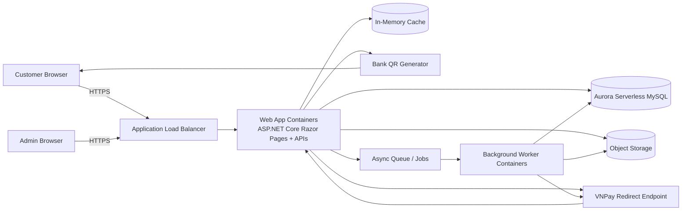
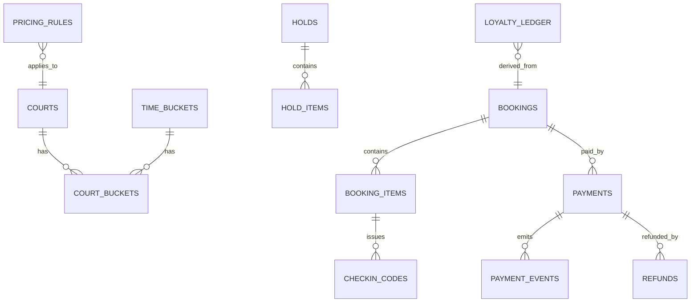
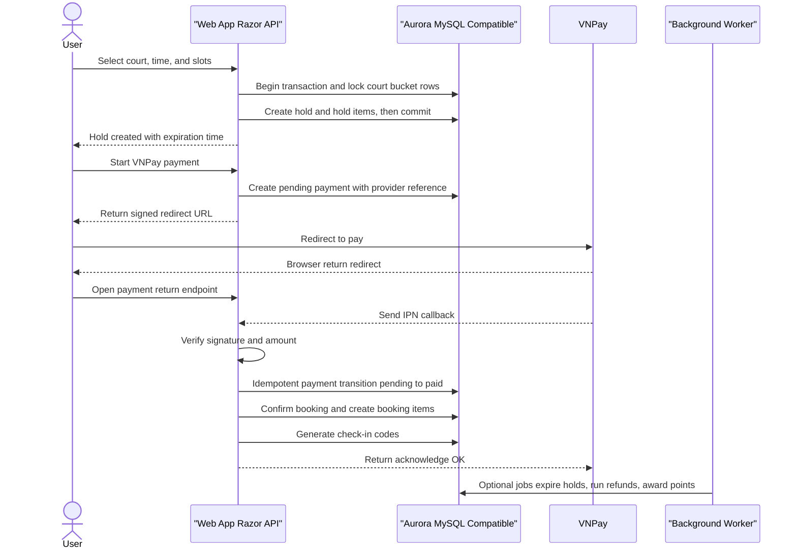
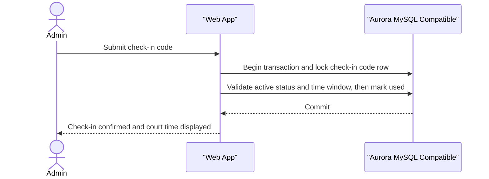

# Pickleball Court Booking Web App System Design and Security Architecture

## Executive summary

This report proposes a scalable, Docker-based system design for the Pickleball Court Booking Web App described in the provided SRS, with **ASP.NET Core (.NET 10 LTS) Razor Pages / MVC** as the mandatory UI framework and **Aurora Serverless v2 (Aurora MySQL-Compatible, InnoDB)** as the system of record. The SRS requires support for **9 courts**, **private bookings by hour**, **shared bookings with up to 8 slots per time frame**, online payments via **VNPay** (redirect + server notification), bank transfer via **dynamic QR**, payment status tracking (Pending/Paid/Failed), **check-in codes generated only after successful payment**, cancellation rules using a “≥ 2 hours” cutoff, loyalty points, and an admin dashboard. 

The recommended architecture is a **stateless web tier** (Razor Pages + JSON APIs) running as Docker containers, paired with a **background worker** container for scheduled tasks, reconciliation, and asynchronous workflows. Horizontal scaling is handled by container orchestration (primary proposal: ECS/Fargate) with autoscaling policies. AWS guidance on Well-Architected design is used as an organizing principle for reliability, security, and operations. 

Capacity target: **10,000 users per week** (small-to-medium). The design prioritizes correctness under contention (popular time slots) using **time-bucket inventory rows**, transactional locking, idempotency, and “hold-to-pay” expiration. Aurora MySQL-Compatible locking reads and InnoDB deadlock behavior are explicitly accounted for to ensure predictable concurrency behavior. 

Local context: if primary users are in **entity["city","Waterloo","Ontario, Canada"]** and **entity["city","Brantford","Ontario, Canada"]**, hosting in AWS **Canada (Central)** (ca-central-1) places the workload in the Montréal area with multiple Availability Zones, optimizing latency while staying in **entity["country","Canada","country"]**. 

## High-level system architecture

### Architecture overview

The architecture is a modular monolith at runtime (single web app for UI + APIs) with clear internal module boundaries so it can evolve into services later without rewriting core logic. This approach reduces operational overhead for the stated scale while still supporting horizontal scaling at the container level. AWS Well-Architected emphasizes building secure, reliable, efficient workloads based on best practices.

Primary hosting proposal uses:
- **VPC with public and private subnets across multiple AZs**; security groups as the primary stateful firewall control; private compute subnets behind a load balancer. 
- **Application Load Balancer (ALB)** as the single ingress point, distributing traffic across tasks in multiple AZs; HTTPS termination uses ACM-managed certificates.  
- **ECS on Fargate** to run Docker containers without managing servers; autoscaling via target tracking policies. 
- **Amazon Aurora Serverless v2 (Aurora MySQL-Compatible Edition)** for the transactional database, encrypted with KMS.
- **In-memory cache (`IMemoryCache`)** inside web app instances for hot-path caching (availability reads) and short-lived non-critical data.
- **S3** for exports (Excel reports), booking receipts, and audit artifacts; encryption default is enabled.
- **Environment variables + encrypted config (AES)** for secrets and sensitive configuration; AES key is injected only at runtime via container environment (ECS task definition), never stored in plaintext files.

### Core components table

| Component | Primary responsibility | Key interactions |
|---|---|---|
| Web app (ASP.NET Core Razor Pages + APIs) | User-facing pages (booking, account), admin dashboard, admin check-in UI, JSON endpoints for SPA-like interactions | Reads/writes Aurora; uses per-instance in-memory cache; calls VNPay; generates QR payloads; emits events to worker |
| Background worker (Docker) | Scheduled jobs (daily resets), hold expiration, payment reconciliation, refund execution, email dispatch, loyalty awarding | Consumes queue/messages; updates Aurora |
| Aurora Serverless v2 (MySQL-compatible, InnoDB) | System of record: bookings, inventory, payments, codes, policies | Transactional locking and unique constraints enforce correctness |
| In-memory cache (per app instance) | Short-TTL availability cache and local hot-path response caching | Used by each web app task independently; no cross-instance coherence |
| VNPay | Redirect-based payment initiation and server-side payment result confirmation | Web app creates signed redirect URL; receives return + server notification|
| Bank QR / VietQR rail | Customer pays by bank transfer scanning a dynamic QR; reconciliation confirms payment | QR payload generation; callback/polling/manual verification depending on bank/provider|
| Operational telemetry (minimal) | Health checks and structured application logs | ALB/app health endpoints and application logs persisted for troubleshooting |

### Mermaid diagram: high-level architecture

## Backend design with APIs, data model, transactions, and idempotency

### Backend structure (ASP.NET Core Razor Pages + internal APIs)

The web app contains:
- **Razor Pages/MVC** for page-focused flows (browse availability, checkout, booking history, admin check-in, admin dashboards). Razor Pages are designed for page-focused web apps in ASP.NET Core.
- **JSON APIs (Controllers)** for interactive operations that demand strict idempotency and concurrency control (create holds, initiate payments, validate check-in codes, admin actions).  
- **ASP.NET Core Identity** for registration/login/password reset and role-based access.

### API endpoints table (representative)

| Area | Method | Endpoint | AuthZ | Idempotency | Notes |
|---|---:|---|---|---|---|
| Availability | GET | `/api/availability?date=YYYY-MM-DD` | Public | N/A | Cached read (in-memory), fallback to DB |
| Hold inventory | POST | `/api/holds` | Customer | Required (`Idempotency-Key`) | Creates time-bucket holds with TTL |
| Cancel hold | DELETE | `/api/holds/{holdId}` | Customer | Safe | Releases hold early |
| Create booking checkout | POST | `/api/checkout` | Customer | Required | Converts hold → pending booking + order |
| VNPay initiate | POST | `/api/payments/vnpay/initiate` | Customer | Required | Generates signed redirect URL per VNPay PAY spec|
| VNPay return | GET | `/payments/vnpay/return` | Public | N/A | Browser redirect return URL handler |
| VNPay server notify (IPN/webhook) | POST | `/payments/vnpay/ipn` | Public (restricted) | Provider idempotency | Verifies secure hash (HMACSHA512) and updates payment state|
| Bank QR create | POST | `/api/payments/bankqr/create` | Customer | Required | Creates dynamic QR payload (amount + ref) |
| Bank QR callback | POST | `/payments/bankqr/callback` | Provider | Provider idempotency | Optional if using VietQR H2H/callback rail |
| Check-in validate | POST | `/api/checkin/validate` | Admin | Required | Validates and atomically redeems a code |
| Cancel booking | POST | `/api/bookings/{id}/cancel` | Customer | Required | Applies “≥2 hours” rule from SRS|
| Admin pricing | PUT | `/admin/pricing/rules/{id}` | Admin | Required | Audited change |
| Admin court status | PUT | `/admin/courts/{id}` | Admin | Required | Enable/disable for maintenance|

Idempotency is implemented at the application layer by requiring an `Idempotency-Key` header on all “create/transition” endpoints, persisting `(user_id, endpoint, idempotency_key, request_hash, response_snapshot)` as a unique record and replaying the stored response if the request repeats.

### Data model (ERD): tables and key fields

The model uses **time buckets** to make concurrency predictable. Each bucket is a discrete interval (typically 60 minutes) and each court has a bucket row that tracks mode and remaining capacity.

| Table | Key fields | Purpose | Constraints / indexes |
|---|---|---|---|
| `courts` | `court_id (PK)`, `name`, `is_active`, `maintenance_reason` | 9 courts, availability toggles | `is_active` index |
| `time_buckets` | `bucket_id (PK)`, `start_at`, `end_at`, `duration_min` | Canonical time slots | `UNIQUE(start_at,end_at)` |
| `court_buckets` | `(court_id, bucket_id) (PK)`, `mode` (NONE/PRIVATE/SHARED), `shared_capacity=8`, `shared_reserved`, `private_booking_id`, `version` | Inventory state per court+bucket | `CHECK shared_reserved<=8`; row locking hot spot |
| `holds` | `hold_id (PK)`, `user_id`, `expires_at`, `status` | Temporary reservation before payment | `INDEX(expires_at,status)` |
| `hold_items` | `hold_item_id (PK)`, `hold_id`, `court_id`, `bucket_id`, `booking_type`, `qty` | What inventory is held | `UNIQUE(hold_id,court_id,bucket_id)` |
| `bookings` | `booking_id (PK)`, `user_id`, `status` (PENDING/CONFIRMED/CANCELLED/COMPLETED), `created_at`, `confirmed_at`, `cancelled_at` | Booking lifecycle | `INDEX(user_id,created_at)` |
| `booking_items` | `booking_item_id (PK)`, `booking_id`, `court_id`, `bucket_id`, `type` (PRIVATE/SHARED), `qty` | Inventory allocated after payment | `INDEX(court_id,bucket_id)` |
| `checkin_codes` | `code_id (PK)`, `booking_item_id`, `code`, `status` (ACTIVE/USED/EXPIRED), `expires_at`, `used_at` | Used by admin for check-in | `UNIQUE(code)`; `INDEX(status,expires_at)` |
| `payments` | `payment_id (PK)`, `booking_id`, `provider` (VNPAY/BANKQR), `status` (PENDING/PAID/FAILED), `amount`, `currency`, `provider_ref`, `provider_txn_no` | Payment state machine | `UNIQUE(provider,provider_ref)` |
| `payment_events` | `event_id (PK)`, `payment_id`, `event_type`, `raw_payload`, `verified`, `received_at` | Audit + dedupe for webhooks | `UNIQUE(provider_event_id)` if available |
| `refunds` | `refund_id (PK)`, `payment_id`, `amount`, `status`, `provider_refund_ref` | Refund processing | `INDEX(status,created_at)` |
| `pricing_rules` | `rule_id (PK)`, `effective_from`, `day_type`, `time_range`, `private_rate`, `shared_rate`, `weekend_markup_pct` | Admin-config pricing | `INDEX(effective_from)` |
| `loyalty_ledger` | `ledger_id (PK)`, `user_id`, `points_delta`, `reason`, `booking_id`, `created_at` | Points after completion | `INDEX(user_id,created_at)` |
| `audit_log` | `audit_id (PK)`, `actor_user_id`, `action`, `entity`, `entity_id`, `diff_json`, `created_at`, `ip` | Admin + security auditing | `INDEX(created_at)` |

Mermaid ERD for quick review:

### Transactions, locking strategy, and idempotency primitives

**Inventory safety rule**: “No double booking same court same time” and “Shared max 8 slots per time frame” must always hold, even under concurrent requests.

Aurora MySQL-Compatible/InnoDB provides the key primitives:
- Locking reads are recommended when reading rows and then updating related rows within the same transaction; plain `SELECT` is insufficient for correctness under concurrency.
- Default InnoDB behavior involves row/index locking and next-key locks under REPEATABLE READ, which helps prevent phantoms but can increase contention if queries are not indexed.
- InnoDB detects deadlocks and rolls back one transaction to break the cycle; the app must implement retries for retryable errors.

Locking option

**Option A (recommended): row-level locks on `court_buckets`**
- Transaction begins.
- For each `(court_id,bucket_id)` involved, lock the row using a locking read (`SELECT ... FOR UPDATE`) in a deterministic order (ascending). Locking reads are explicitly supported by InnoDB.
- Apply invariants:
  - If booking type is PRIVATE: require `mode=NONE` (or `mode=PRIVATE` held by same hold) and set `mode=PRIVATE`.
  - If booking type is SHARED: require `mode IN (NONE,SHARED)` and `(shared_reserved + qty) <= 8`, then set `mode=SHARED` and increment `shared_reserved`.
- Insert `hold_items` rows to record what was reserved.
- Commit.

**Idempotency primitives**
- **Client-side idempotency**: `Idempotency-Key` for all POST/PUT transitions; server enforces uniqueness and replays stored result.
- **Provider-side idempotency**:
  - VNPay transaction reference (`vnp_TxnRef`) must be unique per day per their spec; this maps to `payments.provider_ref` with a unique constraint.
  - Webhook dedupe uses `(provider, provider_txn_no)` and/or `(provider, provider_ref)` plus event hashing.

## Booking, availability, payment, and check-in flows

### Availability algorithm and booking lifecycle

The system uses a “hold-to-pay” model to avoid holding DB locks while a user completes a redirect-based payment:

1. **Browse availability**: the app reads `court_buckets` for a date range and computes availability as:
   - PRIVATE available if `mode=NONE`
   - SHARED available if (`mode IN (NONE,SHARED)` and `shared_reserved < 8`)  
   This read can be cached in per-instance in-memory cache with short TTL (5–15 seconds) to reduce DB read load at peak times.

2. **Create hold (soft reservation)**:
   - Lock inventory rows for the selected buckets.
   - Reserve capacity by switching to PRIVATE or incrementing `shared_reserved`.
   - Create a `hold` with `expires_at` (typically 10–15 minutes).
   - Commit quickly.

3. **Checkout**:
   - Create `booking` in `PENDING` state linked to the hold.

4. **Payment**:
   - VNPay: redirect flow.
   - Bank QR: display QR payload and await confirmation.

5. **Confirm booking**:
   - Only after the payment is verified as successful, finalize booking items and generate check-in codes. The SRS requires check-in codes to be generated only after successful payment.

6. **Expire holds automatically**:
   - Worker scans `holds` past `expires_at` and reverts `court_buckets` reservations, returning `mode` to NONE or decrementing `shared_reserved`.

This design directly limits the risk of “inventory stuck” during payment redirects and scales predictably under bursty contention.

### VNPay integration design (redirect + server confirmation + refund)

VNPay sandbox integration includes a published payment entry URL and merchant identifiers:
- The sandbox payment URL is documented as `https://sandbox.vnpayment.vn/paymentv2/vpcpay.html` and the merchant terminal code is `vnp_TmnCode`. 
- Parameters include `vnp_Command` (PAY uses `pay`) and secure hash validation. 
- Secure hash validation uses **HMACSHA512** by default per the tech spec.

**Initiation**
- Server constructs a payment request with a **server-generated unique** `vnp_TxnRef` mapped to `payments.provider_ref`.
- Server signs parameters with HMACSHA512 using `vnp_HashSecret` loaded from encrypted config (decrypted in-memory at runtime) and redirects the browser to VNPay.

**Return vs server confirmation**
- The browser return handler updates UI state but does not finalize the booking solely based on return parameters.
- The definitive state transition is driven by the server notification and/or an explicit transaction query (`vnp_Command=querydr`) when needed. The tech spec documents `querydr` as the transaction query command. 

**Refund**
- VNPay refund API uses `vnp_Command=refund` plus `vnp_TransactionType` where `02` indicates full refund and `03` indicates partial refund.
- Amount handling: the spec describes representing VND amounts without separators and multiplying by 100 for transmission (example demonstrated in the refund section).
- Refund execution is handled by the worker to isolate external calls and support retries.

**Retry + idempotency rules**
- If VNPay server notifications arrive multiple times, processing is idempotent because `(provider, vnp_TxnRef)` is unique and state transitions are guarded (PENDING → PAID/FAILED is allowed; PAID → PAID is a no-op).

### Bank transfer via dynamic QR and reconciliation

The SRS calls for “bank QR transfer” with dynamic QR based on amount and payment status tracking.

A robust implementation aligns with VietQR/QR payment rails:
- NAPAS describes QR code payment as merchant-presented and states the QR code standard complies with the State Bank’s EMVCo basic standard. 
- EMVCo defines merchant-presented QR payments as the merchant displaying the QR while the consumer scans with a mobile device. 
- VietQR host-to-host documentation describes a dynamic QR that contains amount and transaction details, is valid for a limited time window, and is regenerated per payment. 

**Design**
- QR generation includes:
  - Merchant bank details
  - Exact amount
  - A unique reference string (`bank_ref`) that embeds `booking_id` or a short payment reference
- Payment transitions:
  - `BANKQR_PENDING` immediately after QR creation
  - `BANKQR_PAID` after reconciliation success (callback or polling)
  - `BANKQR_FAILED/EXPIRED` after timeout

**Reconciliation options (trade-offs)**
- Provider callback (best): if a VietQR/bank host-to-host service can send callbacks, the system consumes `/payments/bankqr/callback` and idempotently marks payment as paid.
- Polling (good): worker polls bank transaction API for the reference + amount.
- Manual verification (fallback): admin marks bank transfer as received, with dual-control (two-admin review) for higher-value transactions.

Cancellation refunds for bank transfers are operationally harder to automate than VNPay refunds; the SRS itself highlights wallet refunds as operationally efficient. 

### Check-in and code generation logic

The check-in module requires random codes, admin verification, deactivation after use, and end-of-day reset of unused codes. 

**Code generation**
- Use .NET cryptographic RNG: `RandomNumberGenerator` is intended for generating cryptographically strong random values and is the preferred mechanism for random generation in security-sensitive contexts. 
- Code format: `PB-` + 6–8 characters (Crockford Base32 or uppercase alphanumerics excluding ambiguous characters).  
- Persist each code in `checkin_codes` with:
  - `status=ACTIVE`
  - `expires_at = booking_end_at` (or end-of-day cutoff)
  - unique constraint on `code`

**Redemption**
- Admin submits code.
- Single transaction:
  - `SELECT ... FOR UPDATE` on `checkin_codes` row
  - Validate status and booking time window
  - Mark `USED` with `used_at`, record `admin_user_id`, and write an audit log
- Commit.

**End-of-day reset**
- Scheduled job marks `ACTIVE` codes that are past the day boundary as `EXPIRED`.  
- This aligns with Cloud scheduling patterns; on AWS, a scheduled action plus worker processing is typical operational practice. 

## Security architecture and controls

Security controls are aligned to practical web application risks (OWASP) with an in-app-first protection strategy.

### Application-layer security

| Control | Implementation in ASP.NET Core | Threats addressed |
|---|---|---|
| Parameterized queries | Use EF Core LINQ/parameters or parameterized ADO.NET commands only; disallow raw SQL string concatenation in booking/payment paths | SQL injection prevention on write/read endpoints |
| Razor default HTML encoding | Keep Razor default output encoding; require explicit review for `Html.Raw` usage | XSS risk reduction in UI rendering paths |
| Validate input model | Use DataAnnotations + server-side allowlists/range checks for booking/payment DTOs and admin forms | Invalid input, mass assignment, and business-rule bypass reduction |
| CSRF protection | Apply `AutoValidateAntiforgeryToken` for Razor POST/PUT/DELETE actions; require antiforgery token validation on state-changing browser requests | CSRF mitigation for authenticated web flows |
| Secure cookie configuration | Configure auth/session cookies with `Secure`, `HttpOnly`, `SameSite=Lax/Strict`, short idle timeout, and HTTPS-only transport | Session theft and cross-site cookie abuse reduction |
| Rate limiting | Use ASP.NET Core rate limiting middleware (global + endpoint policies), especially for login, hold creation, checkout, and webhook endpoints | Abuse, brute-force, and burst traffic stabilization |
| Secure headers (critical) | Set `Content-Security-Policy`, `X-Content-Type-Options: nosniff`, `X-Frame-Options`/`frame-ancestors`, `Referrer-Policy`, and strict `Cache-Control` for sensitive responses | XSS, clickjacking, MIME sniffing, and data leakage mitigation |
| Validate payment webhook signature | Verify VNPay webhook signature (HMACSHA512) and reject mismatched payloads before any state transition | Forged callback and payment tampering prevention |
| Idempotency for booking & payment | Enforce `Idempotency-Key` for create/transition APIs; store unique idempotency records and replay response on duplicate requests | Duplicate booking/payment due to retries or network issues |

### Payment security (VNPay + bank QR)

| Control | Design choice | Foundation |
|---|---|---|
| Secure hash validation | Verify VNPay secure hash using HMACSHA512 for every return/server notification; reject mismatches | VNPay tech spec states checksum protects data integrity and default supports HMACSHA512 citeturn11view1turn12view2 |
| Webhook idempotency | Store provider reference and transaction number; process transitions once | Provider returns repeatable fields such as `vnp_TxnRef`, `vnp_TransactionNo` citeturn11view1turn12view1 |
| Network restrictions | Enforce HTTPS-only on ALB; optional IP allowlisting for `/payments/vnpay/ipn` if VNPay publishes fixed ranges; reject requests failing signature validation | ALB HTTPS + app-layer signature validation protect payment transitions |
| Reconciliation for bank QR | Require unique reference per payment; confirm amount+ref before marking paid; maintain immutable payment event log | VietQR dynamic QR includes transaction details; NAPAS/EMVCo merchant-presented QR patterns support structured payloads citeturn3search0turn3search4turn3search1 |

### Infrastructure and data security

| Control | AWS-native approach | Source basis |
|---|---|---|
| Network segmentation | Public subnets for ALB/NAT; private subnets for app+DB; multi-AZ subnet design | AWS VPC security best practices recommend multi-AZ subnets and security groups  |
| TLS certificates | Use ACM-managed certificates and HTTPS listeners on ALB | HTTPS listener requires a certificate and terminates front-end TLS  |
| Secrets | Store only encrypted config in source/artifacts; decrypt at runtime with AES key from environment variable injected by container runtime (ECS task definition) | Runtime-only key injection prevents plaintext key persistence in repository and images |
| Encryption at rest | Encrypt Aurora using KMS; encrypt S3 (default encryption) | Aurora uses KMS keys; S3 encrypts objects by default |
| Central audit for cloud actions | Enable CloudTrail and store logs in S3 | CloudTrail records AWS API calls and delivers logs to S3 |
| Log retention and hygiene | Persist application logs and define explicit retention/lifecycle policies | Retention policy is managed as part of operations runbook |
| In-app protections only | Security middleware and coding standards: secure headers, antiforgery, strict model validation, parameterized data access, and app-layer rate limiting | Defense-in-depth centered in application layer |

### Security-critical operational practices

- **Admin access hardening**: enforce MFA for admin identities; restrict admin screens with Razor Pages authorization conventions.
- **Key ring protection** (ASP.NET Core Data Protection): store the Data Protection key ring in a secure location and restrict access; protect at rest and scope access to the app identity.
- **Deadlock-safe retries**: handle InnoDB deadlock rollbacks with bounded retry and jitter on inventory transactions. 
- **Secret handling rules**:
  1. Do not write secret keys into logs or plaintext config files.
  2. Environment variable containing AES key must be set only at runtime (container environment or ECS task definition).

## Deployment and operational posture for scalability

### Containerization and runtime scaling

- Docker image build and distribution: container images are stored in a registry; Docker documentation defines registries as centralized places to store and share images.
- On AWS, ECR is a managed container image registry described as secure, scalable, and reliable, and supports IAM-controlled access; images are pushed with standard Docker tooling.
- ECS Service Auto Scaling supports target tracking policies that adjust task counts based on metrics and maintain a target value. 

For the 10,000 users/week scale, the principal scalability requirements are:
- multiple web app tasks (2–6+) behind ALB, scaling out on CPU, memory, or request count
- DB sized primarily for write bursts on “hold creation” and “payment confirmation”
- Per-instance in-memory cache to offload availability reads

### Availability and fault tolerance

- Multi-AZ deployment patterns are used at the network layer and load balancer layer; ALB distributes across targets in multiple AZs to increase availability.
- For AWS Canada (Central), AWS documents multiple Availability Zones in the region; the region is in the Montréal area.  

### Operational hooks

- Expose health endpoints (`/healthz`, `/readyz`) for ALB target health and operational diagnostics.
- Keep structured application logs for incident analysis and payment-flow troubleshooting.
- Route 53 health checks can monitor public endpoints to support basic uptime monitoring. 

### Minimal operational runbook (security-relevant)

Operational tasks implied directly by the SRS and security posture:
- **Daily**: expire unused check-in codes (end-of-day reset) and expire stale holds. fileciteturn0file0  
- **Continuous**: monitor payment webhook error rates, booking hold contention, and failed login anomalies (audit log + metrics). citeturn6search2turn5search11  
- **Incident response**: rotate compromised AES environment key, re-encrypt sensitive config, and force new task deployment; CloudTrail provides the audit history of configuration and API actions. citeturn7search10turn7search2  

### Mermaid diagram: booking + VNPay sequence

### Mermaid diagram: check-in redemption

